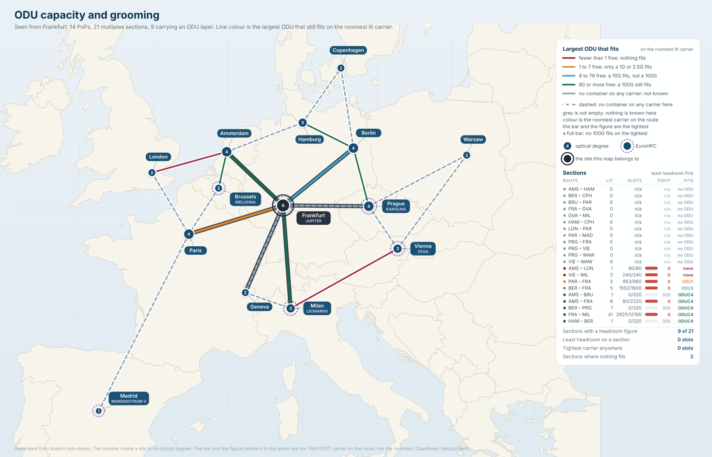

<p align="center">
<a href="https://www.linkedin.com/company/opsmill">

</a>
<a href="https://discord.gg/opsmill">

</a>
</p>

# Optical transport demo

An optical transport network modelled in [Infrahub](https://github.com/opsmill/infrahub),
down to the fiber span and the wavelength. Use it to provision a service from
intent alone, to compute an optical link budget from the modelled plant, and to
answer what a fiber cut takes down.

The network is a European research core: 14 PoPs and one customer campus, 21
optical multiplex sections, 133 fiber spans, 306 amplifiers, 1488 ports and 40
provisioned wavelengths, each anchored on one of 96 grid positions and each
occupying a width of spectrum around it.

---

## The two maps every PoP carries

Both are Infrahub artifacts. Each renders from the branch it is asked for, so
every figure on them is read from the model rather than drawn by hand. Click
either one to open it at full size.

[](docs/docs/media/network-map.svg)

**European optical core.** Colour answers one question: does a wavelength close
on this route? Red is Paris to Madrid, which does not close unamplified and
needs the Raman pumps. This is the optical layer, and the
[network map](docs/docs/network-map.mdx) page reads it panel by panel.

[](docs/docs/media/odu-map.svg)

**ODU capacity and grooming.** Same coastline, same discs, same routes,
different question: does another circuit fit on this one? This is the digital
layer above the light, and the [ODU map](docs/docs/odu-map.mdx) page reads it.

The optical layer and the digital layer above it, from one model on one
branch.

---

## What you can do with it

- **Provision a wavelength from intent.** Name two routers, a rate and an SLA.
  The generator finds every candidate route, budgets each one at every
  transponder mode that reaches the rate, picks the narrowest mode that closes,
  assigns a channel, and writes the carrier, the path, the per-element hop table
  and the OTN container.
- **Compute an optical link budget from modelled data.** Span loss, amplifier
  gain and noise figure, ROADM insertion loss, OSNR cascade, chromatic
  dispersion and latency, summed over the ordered chain. No spreadsheet, and no
  number typed in twice.
- **Report what a fiber cut takes down.** Name a section and get the
  wavelengths, the terabits, the services and the customers behind it, plus the
  ducts each span runs through and what else runs through the same duct.
- **Plan capacity without believing the free-megahertz total.** Free spectrum
  per section and per route, as blocks, derived at read time from the carriers on
  the branch rather than stored as occupancy state. The report then says how many
  of the 96 anchors will actually take another carrier, per mode, which is always
  fewer than free spectrum divided by width suggests. See
  [Capacity planning](#capacity-planning).
- **Check a route against a latency budget.** Propagation, ROADM and amplifier
  delay and FEC, against the budget a service profile carries.
- **Find services that are not diverse.** Read off the conduits rather than
  the sections, so two services that share no section and no city pair still
  show up when one backhoe would take both.
- **Enforce diversity somebody actually promised.** Put two services in a
  diversity group and a check fails the merge when their routes share a duct. It
  says nothing about services nobody made a promise about, so an exposure an
  operator accepted stays accepted.
- **Build a route no single wavelength can cross.** Split it at an O-E-O
  regenerator and budget each half on its own. The demo tries three regenerator
  sites on Madrid to Warsaw, all three are refused at DP-16QAM, and the fix turns
  out to be a regenerator and a different modulation.
- **Block a bad merge.** Nine checks run against a proposed change: the
  shared package imports in the worker, no two carriers claim the same channel
  on the same section, every wavelength still closes its OSNR margin, no
  container commits more tributary slots than its parent offers, no two
  circuits an operator declared diverse route through the same duct, no
  service the model refused reaches the default branch unless somebody signed
  for the refusal, no degree monitor disagrees with the carriers on its
  section, no device that should carry a monitor is missing one, and no active
  wavelength is left half-terminated.
- **See the drift.** Every other report predicts. One compares: configured gain
  against the gain each amplifier and Raman pump last reported delivering, so a
  stage sliding towards a maintenance visit is named before it fails anything.

---

## Who this is for

**Evaluator:** You want to see whether Infrahub can hold a transport network,
not a data center. Clone it, run one command, and browse 2342 objects and eight
reports. No prior Infrahub experience needed.

> Start with [Quick start](#quick-start) below, then the docs site: the
> [quick start page](docs/docs/quickstart.mdx) takes you from a clone to
> a merge that will not close, and the [demo guide](docs/docs/demo-guide.mdx)
> covers the nine scenarios.

**Network automation engineer:** You want to know what Infrahub does, and the
optics is only the example. Branches, proposed changes, checks that gate a
merge, generators, artifacts and transforms are all exercised here, and a
wavelength plays the part a prefix or a VLAN plays in your own domain.

> Go to [what this demo shows](docs/docs/what-this-shows.mdx#for-the-network-automation-engineer),
> which maps every capability to the scenario that exercises it.

**Optical engineer:** You design corridors in a planning tool and turn services
up through a controller. This demo holds the record those two tools do not
share: every vendor, every layer and every project on one branch, reviewed
before it becomes true. The optical model is verified against hand-computed
reference values, every quantity is a scaled integer with the unit in the
attribute name, and the demo reports its negative results: 400ZR reaches
nothing on this network, Madrid has no diverse route, and one site pair breaks
the dispersion limit.

> Go to [where this sits next to your planner and your NMS](docs/docs/what-this-shows.mdx#for-the-optical-engineer),
> then the [link budget](docs/docs/link-budget.mdx) and the
> [schema reference](docs/docs/schema-reference.mdx).

**Implementer:** You want patterns for generators that refuse, checks that
replace stored state, and reports that read a branch. The decision layer imports
no SDK, so all of it is tested with no server running.

> Go to the [developer guide](docs/docs/developer-guide.mdx).

This repository models the optical layer, which is the one usually left out.
Any layer can be modelled the same way, and other repositories already have.
[infrahub-demo-dc](https://github.com/opsmill/infrahub-demo-dc) models a data
center down to cables, VLANs and IP space.
[infrahub-demo-sp](https://github.com/opsmill/infrahub-demo-sp) models a service
provider core with MPLS, BGP and L3VPN services.
[infrahub-solution-ai-dc](https://github.com/opsmill/infrahub-solution-ai-dc)
models an AI data center from the physical location up through the routing
overlay to the workload. The approach is the same at every layer. Only the
physics is specific to this one.

---

## Prerequisites

- Python 3.11+ and [uv](https://docs.astral.sh/uv/)
- Docker and Docker Compose (v2)
- About 8 GB of free memory for the Infrahub stack

---

## Quick start

```bash
git clone git@github.com:opsmill/infrahub-demo-otn.git
cd infrahub-demo-otn
cp .env.example .env
uv sync

# Build the image, start the stack, load the schema, the menu and the dataset
uv run invoke init
```

Infrahub comes up at [http://localhost:8000](http://localhost:8000).

Then set the demo scenarios up on a branch and run the first one:

```bash
uv run invoke demo-setup
uv run invoke demo-capacity
```

`uv run invoke list` prints the tasks you need, grouped, and `--all` adds the
rest. Every step of the demo guide is one of them, so nothing in this repository
asks you to remember a command-line tool's subcommands or to export an API
token.

---

## What you will see

`invoke demo-provision` asks for 400G from Berlin to Amsterdam. The request is
eight lines: two routers, a rate, an SLA and a service profile. No route, no
wavelength, no channel.

The generator finds six candidate routes, budgets each at every mode that
reaches 400G, and prints all six with the reason each one lost:

```text
svc-ber-ams-400g: candidate 1 of 6 is oms-ham-ber|oms-ams-ham on DP-16QAM 64GBd 400G,
  2 sections, 800 km, margin +2.284 dB, 3923.026 us, channel 1
...
svc-ber-ams-400g: chose oms-ham-ber|oms-ams-ham on DP-16QAM 64GBd 400G, channel 1,
  800 km, margin +2.284 dB, 3923.026 us
```

Copenhagen is 110 km longer than Prague and has the better margin, because span
loss enters the OSNR cascade exponentially while route length enters it
linearly. Route length alone does not order signal quality.

The run writes 28 objects and changes one: the carrier, the path, 25 hop rows
carrying the running loss, OSNR and delay at each element, the OTN container,
and the service moved to `active`. Run it again and the counts do not move.

Then `invoke demo-refusal` fills the Frankfurt to Milan corridor and asks for a
service across it. The answer is a refusal with a reason, and the reason is
`no-slots`: the one route inside the four-millisecond budget still has a
wavelength free to groom into, and that wavelength has 240 of its 320 tributary
slots left where the 400G client needs all 320. Every longer route is named and
discarded on latency in the same message, so nobody has to ask which escape was
tried.

The reason is a `Dropdown` of six values rather than a sentence, so refusals can
be filtered and counted. That file signs for its refusal with `refusal_accepted`
and the branch merges. Madrid to Warsaw does not, and its proposed change goes
red.

---

## Capacity planning

Free spectrum is not capacity, and that is the finding the rest of the model is
built around.

Frankfurt to Milan is the busiest section. Its 40 wavelengths hold 4,134,400 MHz
of the 4,800,000 MHz the C-band gives it, leaving 665,600 MHz free in 26 blocks.
Divide that by the 79,600 MHz a 400G DP-16QAM carrier occupies and the answer is
eight more wavelengths. The answer the model gives is one, at channel 95.

The gap is quantisation. A carrier's centre may only sit on one of 96 grid
positions, and its whole width has to fit inside a single free block. Twenty-five
of those 26 blocks are 38,000 MHz or narrower, against a narrowest catalog mode
of 44,400 MHz, so they fit nothing at all. `invoke demo-capacity` says which of
the two problems a section has, too little spectrum or spectrum in the wrong
shape, because the fixes are different: one is more glass, the other is a rewrite
of the anchor plan.

The report answers per mode, and it names the modes that fit nowhere rather than
leaving them out. On the shipped dataset all ten catalog modes still fit on that
corridor, eight of them only on channel 95. Load `demo/04_odu_ten_in_one.yml`,
which spends the one wide block, and all ten fit nowhere.

> The [spectral model](docs/docs/spectral-model.mdx) page has the
> widths, the guard band and the arithmetic.

---

## What's included

- **Schemas.** 44 kinds across eight files: sites, the EuroHPC facilities on
  them and a location hierarchy,
  conduits, fiber spans and optical multiplex sections, ROADMs, amplifiers,
  transponders, mux/demux, patch panels and O-E-O regenerators, seven port
  kinds, the DWDM frequency grid and the CWDM wavelength plan, optical modes,
  client signals, diversity groups, and the service, carrier, path and container
  model.
- **Dataset.** A European research core, generated from a seed and guarded by
  a regenerate-and-diff test: 15 sites of which 14 are PoPs, 12 conduits, 133
  fiber spans across 21 optical multiplex sections, 306 amplifiers, 14 ROADMs,
  59 transponders, 20 routers, three O-E-O devices at the two hub sites,
  1488 ports, and 40 wavelengths holding 4,134,400 MHz of the 4,800,000 MHz the
  C-band gives the busiest section.
- **Catalogs.** The fixed 50 GHz C-band grid at all 96 channels, the coarse
  18-wavelength plan beside it, 10 optical modes from DP-QPSK 32GBd 100G to
  DP-64QAM 64GBd 600G including the ZR pluggables, 11 client signals, and 3
  fiber types.
- **Engine.** Loss, OSNR, dispersion and latency over an ordered chain; route
  and mode selection; carrier widths, free blocks and the anchors inside them;
  the tributary slot table and the capacity rule; the
  carrier cover that decides which wavelengths make one regenerated circuit;
  occupancy, reach, exposure and latency verdicts. Pure Python, no SDK import,
  tested offline.
- **Generator.** Takes a service request and provisions it, or refuses it and
  stores the reason on the service as a code and a detail. It runs ahead of the
  checks in the same proposed change, so the gate reads a verdict written
  seconds earlier and never a stale one.
- **Checks.** Shared-package import, channel collision, OSNR margin, container
  capacity, declared diversity, the provisionable gate, channel count
  consistency, monitor completeness and carrier termination.
- **Reports.** Service trace, impact, capacity, reach, AI latency, SRLG
  exposure, link budget and monitor drift, each with its own GraphQL query, plus
  the two rendered maps.
- **Tasks.** 48 invoke tasks, one per lifecycle step, per demo scenario and
  per loadable scenario. `invoke list` prints the 27 a reader needs and `--all`
  adds the other 21. `invoke load` does the loading in one step, and
  `invoke demo` runs the whole walkthrough in ten steps.

---

## Documentation

This file is the half you read before you clone: what the demo is, what you can
do with it, and how to start it. The
[overview](docs/docs/overview.mdx) is the half you read once it is
running: why the model is shaped the way it is, and what each layer answers.
Where both state a figure, it is the same figure.

| Topic | Resource |
|---|---|
| **What this models** | [Overview](docs/docs/overview.mdx) |
| **Set the environment up** | [Install and load the demo](docs/docs/installation-setup.mdx) |
| **Run the demo** | [Demo guide](docs/docs/demo-guide.mdx) |
| **Optical concepts** | [Concepts](docs/docs/concepts.mdx) |
| **The link budget math** | [Link budget](docs/docs/link-budget.mdx) |
| **Why free spectrum overstates capacity** | [Spectral model](docs/docs/spectral-model.mdx) |
| **Every kind and attribute** | [Schema reference](docs/docs/schema-reference.mdx) |
| **AI and HPC latency** | [AI payloads](docs/docs/ai-payloads.mdx) |
| **Client signal mapping** | [Client mapping](docs/docs/client-mapping.mdx) |
| **The map on every PoP** | [Network map](docs/docs/network-map.mdx) · [ODU map](docs/docs/odu-map.mdx) |
| **Change the repository** | [Developer guide](docs/docs/developer-guide.mdx) |
| **Infrahub core docs** | [Generators](https://docs.infrahub.app/topics/generator) · [Checks](https://docs.infrahub.app/topics/check) |

---

## About Infrahub

[Infrahub](https://github.com/opsmill/infrahub) is an open source infrastructure
data management and automation platform (AGPLv3), developed by
[OpsMill](https://opsmill.com). It gives infrastructure and network teams a
unified, schema-driven source of truth for all infrastructure data (devices,
topology, IP space, configuration) with built-in version control, a Generator
framework for automation, and native integrations with Git, Ansible, Terraform,
and CI/CD pipelines.
